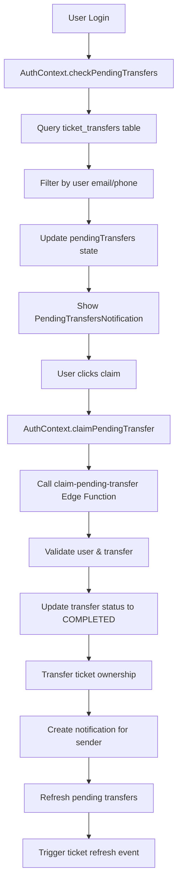

# AuthContext Integration for Ticket Transfers

## 🎯 Overview

This document explains how the ticket transfer system has been integrated into your AuthContext, providing a seamless user experience for managing ticket transfers and pending claims.

## 🔧 What Was Added

### 1. **AuthContext Enhancements**

#### New State Properties:
```typescript
interface AuthState {
  // ... existing properties
  pendingTransfers: any[];           // Array of pending transfers for the user
  checkPendingTransfers: () => Promise<void>;     // Check for pending transfers
  claimPendingTransfer: (transferId: string) => Promise<boolean>;  // Claim a transfer
  refreshUserTickets: () => Promise<void>;        // Refresh ticket data
}
```

#### New Methods:

**`checkPendingTransfers()`**
- Automatically called when user logs in
- Fetches pending transfers by email or phone
- Updates the `pendingTransfers` state

**`claimPendingTransfer(transferId)`**
- Claims a pending transfer
- Updates transfer status to 'COMPLETED'
- Transfers ticket ownership to current user
- Sends notification to sender
- Refreshes pending transfers and user tickets

**`refreshUserTickets()`**
- Triggers a custom event for components to refresh ticket data
- Useful after claiming transfers or other ticket operations

### 2. **PendingTransfersNotification Component**

A floating notification component that:
- Shows a gift icon with badge count of pending transfers
- Displays a modal with all pending transfers
- Allows users to claim transfers with one click
- Shows transfer details (sender, message, ticket info)
- Handles loading states and error messages

### 3. **Claim Pending Transfer Edge Function**

**Endpoint:** `/functions/v1/claim-pending-transfer`

**Purpose:** Handles the server-side logic for claiming pending transfers

**Features:**
- Validates user authentication
- Verifies user is the intended recipient
- Checks transfer status and ticket availability
- Updates transfer and ticket records atomically
- Creates notifications for the sender
- Handles error cases gracefully

### 4. **Ticket Refresh Hook**

**`useTicketRefresh()`**
- Listens for ticket refresh events
- Returns a trigger value that increments on refresh
- Useful for components that display ticket data

**`useTriggerTicketRefresh()`**
- Provides a function to trigger ticket refresh
- Useful for components that need to refresh ticket data

## 🚀 How It Works

### User Flow:

1. **User A transfers ticket to User B** (who doesn't have an account yet)
2. **Transfer is created with status 'PENDING'**
3. **User B signs up** with the email/phone used in transfer
4. **AuthContext automatically checks for pending transfers**
5. **PendingTransfersNotification shows up** with gift icon and badge
6. **User B clicks to view pending transfers**
7. **User B claims the transfer** with one click
8. **Ticket ownership is transferred** to User B
9. **User A gets notification** that transfer was claimed
10. **Both users see updated ticket data**

### Technical Flow:



## 📱 UI Components

### PendingTransfersNotification

**Location:** Floating button in top-right corner

**Features:**
- 🎁 Gift icon with red badge showing count
- 📱 Responsive modal design
- 🎫 Ticket preview with event details
- ⚡ One-click claim functionality
- 🔄 Loading states and error handling
- 💬 Shows sender message if provided

### Integration in App.tsx

```tsx
import PendingTransfersNotification from './components/tickets/PendingTransfersNotification';

function App() {
  return (
    <ErrorBoundary>
      <div className="min-h-screen flex flex-col bg-gradient-to-br from-purple-50 to-indigo-50">
        <AppBanner />
        <Navbar />
        <main className="flex-grow">
          <AppRoutes />
        </main>
        <Footer />
        <Toaster position="top-right" />
        <OfflineWarning />
        <PendingTransfersNotification />  {/* ← Added here */}
      </div>
    </ErrorBoundary>
  );
}
```

## 🔄 Event System

### Custom Events

**`tickets-refreshed`**
- Triggered when ticket data needs to be refreshed
- Components can listen to this event to update their data
- Used after claiming transfers or other ticket operations

### Usage in Components

```tsx
import { useTicketRefresh } from '../hooks/useTicketRefresh';

function MyTicketComponent() {
  const refreshTrigger = useTicketRefresh();
  
  // Component will re-render when tickets are refreshed
  // Use refreshTrigger as a dependency in useEffect
}
```

## 🛡️ Security Features

### Transfer Validation
- ✅ User must be authenticated
- ✅ User must be the intended recipient (email/phone match)
- ✅ Transfer must be in 'PENDING' status
- ✅ Ticket must still belong to original sender
- ✅ Ticket cannot be scanned (already used)

### Error Handling
- 🔒 Invalid authentication → 401 Unauthorized
- 🔍 Transfer not found → 404 Not Found
- ❌ Not the intended recipient → 403 Forbidden
- ⚠️ Transfer no longer pending → 400 Bad Request
- 🎫 Ticket already transferred → 400 Bad Request
- 📱 Ticket already scanned → 400 Bad Request

## 📊 Database Changes

### New Edge Function
- `claim-pending-transfer` - Handles claiming pending transfers

### Updated Tables
- `ticket_transfers` - Status updated to 'COMPLETED'
- `tickets` - Ownership transferred to new user
- `notifications` - Sender notified of successful claim

## 🎨 Styling

### Design System
- **Colors:** Purple to pink gradient theme
- **Icons:** Lucide React icons (Gift, User, Calendar, etc.)
- **Layout:** Responsive modal with mobile-first design
- **Animations:** Smooth transitions and hover effects
- **Typography:** Clear hierarchy with proper contrast

### Responsive Design
- 📱 Mobile: Full-screen modal with touch-friendly buttons
- 💻 Desktop: Centered modal with optimal width
- 🎯 Accessibility: Proper focus management and keyboard navigation

## 🚀 Deployment

### Required Steps:

1. **Deploy the Edge Function:**
   ```bash
   supabase functions deploy claim-pending-transfer
   ```

2. **Update Frontend:**
   - AuthContext integration is already complete
   - PendingTransfersNotification component is ready
   - App.tsx integration is done

3. **Test the Flow:**
   - Transfer a ticket to a non-registered user
   - Sign up with that email/phone
   - Verify notification appears
   - Claim the transfer
   - Verify ticket ownership transfer

## 🔧 Customization

### Modifying the Notification

**Change the position:**
```tsx
// In PendingTransfersNotification.tsx
<div className="fixed top-4 right-4 z-50">  // Change position here
```

**Change the styling:**
```tsx
// Modify the gradient colors
className="bg-gradient-to-r from-purple-600 to-pink-600"
```

**Change the icon:**
```tsx
import { Gift } from 'lucide-react';  // Change to any Lucide icon
```

### Adding More Features

**Email notifications:**
- Add email service integration in the Edge Function
- Send email when transfer is claimed

**Push notifications:**
- Integrate with push notification service
- Send real-time notifications for pending transfers

**Transfer history:**
- Add transfer history to user profile
- Show all sent and received transfers

## 🐛 Troubleshooting

### Common Issues:

1. **Notification not showing:**
   - Check if user email/phone matches transfer recipient
   - Verify transfer status is 'PENDING'
   - Check browser console for errors

2. **Claim fails:**
   - Verify user is authenticated
   - Check if transfer is still pending
   - Ensure ticket hasn't been scanned

3. **Tickets not refreshing:**
   - Check if components are listening to 'tickets-refreshed' event
   - Verify useTicketRefresh hook is being used

### Debug Mode:

Add console logs to see what's happening:

```tsx
// In AuthContext.tsx
const checkPendingTransfers = async () => {
  console.log('Checking pending transfers for user:', user?.email);
  // ... rest of the function
};
```

## 📈 Performance Considerations

### Optimizations:
- **Debounced checks:** Pending transfers are only checked on login
- **Efficient queries:** Only fetch necessary data for transfers
- **Event-driven updates:** Components refresh only when needed
- **Error boundaries:** Graceful error handling prevents crashes

### Monitoring:
- Track transfer claim success rates
- Monitor Edge Function performance
- Log transfer-related errors
- Monitor database query performance

## 🎉 Benefits

### For Users:
- ✅ **Seamless experience:** No manual steps required
- ✅ **Real-time notifications:** Know when transfers are available
- ✅ **One-click claiming:** Easy to claim transferred tickets
- ✅ **Visual feedback:** Clear status indicators and loading states

### For Developers:
- ✅ **Clean integration:** Minimal changes to existing code
- ✅ **Reusable components:** Easy to use in other parts of the app
- ✅ **Type safety:** Full TypeScript support
- ✅ **Error handling:** Comprehensive error management

This integration provides a complete, production-ready ticket transfer system that enhances the user experience while maintaining code quality and security! 🚀
