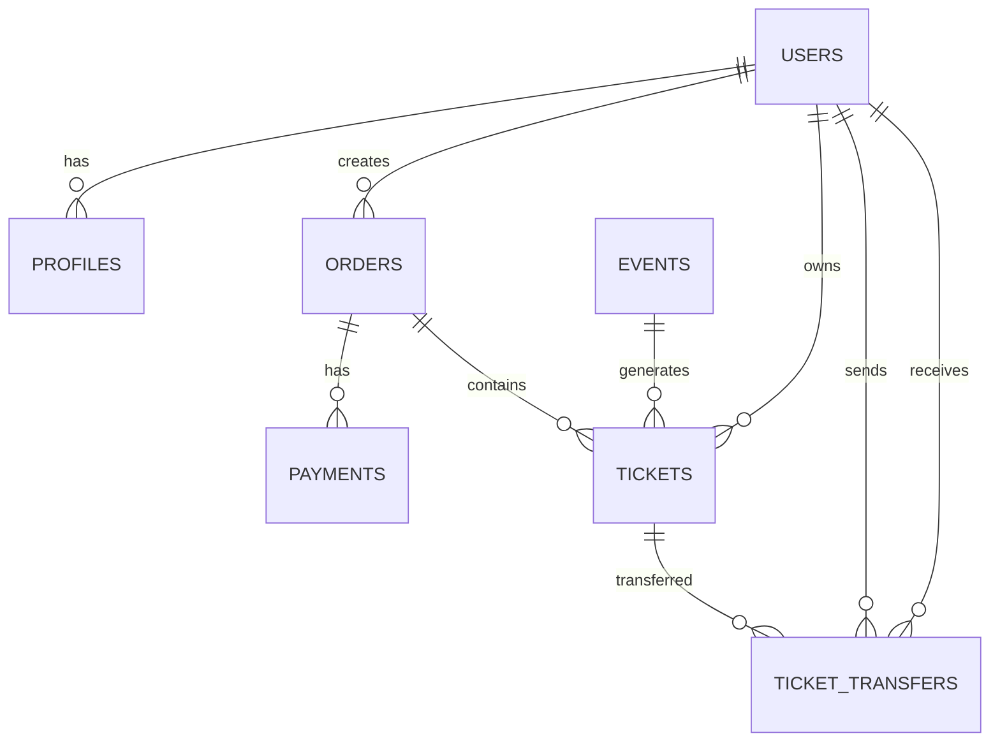

# System Architecture

## 🏗️ Platform Overview

Temba is a modern event ticketing platform built with a microservices architecture, providing seamless ticket purchasing, transfer capabilities, and real-time notifications.

## 🛠️ Technology Stack

### Frontend
- **Framework**: React 18 with TypeScript
- **Build Tool**: Vite
- **Styling**: Tailwind CSS
- **State Management**: React Context + Hooks
- **Routing**: React Router v6
- **UI Components**: Custom components with Lucide React icons

### Backend
- **Runtime**: Deno (Supabase Edge Functions)
- **Database**: PostgreSQL (Supabase)
- **Authentication**: Supabase Auth
- **Real-time**: Supabase Realtime
- **Storage**: Supabase Storage
- **API**: RESTful APIs with GraphQL-like queries

### Infrastructure
- **Hosting**: Netlify (Frontend) + Supabase (Backend)
- **CDN**: Netlify CDN
- **Database**: Supabase PostgreSQL
- **Edge Functions**: Supabase Edge Runtime
- **Monitoring**: Supabase Dashboard + Custom logging

## 🏛️ System Components

### 1. Frontend Application
```
src/
├── components/          # Reusable UI components
├── pages/              # Page components
├── context/            # React Context providers
├── services/           # API service layers
├── hooks/              # Custom React hooks
├── utils/              # Utility functions
└── types/              # TypeScript type definitions
```

### 2. Backend Services
```
supabase/
├── functions/          # Edge Functions
│   ├── transfer-ticket/
│   ├── claim-pending-transfer/
│   ├── create-stripe-payment/
│   ├── stripe-webhook/
│   └── ...
├── migrations/         # Database migrations
└── config.toml         # Supabase configuration
```

### 3. Database Schema
```
Database Tables:
├── auth.users          # User authentication
├── profiles            # User profiles
├── events              # Event information
├── tickets             # Ticket records
├── orders              # Order management
├── payments            # Payment records
├── ticket_transfers    # Ticket transfer records
├── notifications       # User notifications
└── service_fee_rules   # Fee calculation rules
```

## 🔄 Data Flow Architecture

### 1. User Authentication Flow
```
User Login → Supabase Auth → JWT Token → Frontend State → API Calls
```

### 2. Payment Processing Flow
```
Ticket Selection → Payment Method → Edge Function → Payment Provider → Webhook → Database Update → Ticket Generation
```

### 3. Ticket Transfer Flow
```
Transfer Request → Validation → Edge Function → Database Update → Real-time Notification → Recipient Claim
```

## 🔐 Security Architecture

### Authentication & Authorization
- **JWT Tokens**: Secure user authentication
- **Row Level Security (RLS)**: Database-level access control
- **CORS Policies**: Cross-origin request protection
- **Input Validation**: Server-side data validation
- **Rate Limiting**: API request throttling

### Data Protection
- **Encryption**: Data encrypted in transit and at rest
- **Privacy**: GDPR-compliant data handling
- **Audit Logs**: Complete action tracking
- **Backup**: Automated data backups

## 📊 Database Design

### Core Entities


### Key Relationships
- **Users ↔ Profiles**: One-to-one relationship
- **Users ↔ Orders**: One-to-many relationship
- **Orders ↔ Payments**: One-to-many relationship
- **Events ↔ Tickets**: One-to-many relationship
- **Tickets ↔ Transfers**: One-to-many relationship

## 🚀 Performance Architecture

### Frontend Optimization
- **Code Splitting**: Lazy loading of components
- **Bundle Optimization**: Tree shaking and minification
- **Caching**: Browser caching strategies
- **CDN**: Global content delivery

### Backend Optimization
- **Edge Functions**: Serverless compute at edge
- **Database Indexing**: Optimized query performance
- **Connection Pooling**: Efficient database connections
- **Caching**: Redis-like caching strategies

### Real-time Features
- **WebSocket Connections**: Real-time updates
- **Event Streaming**: Live data synchronization
- **Push Notifications**: Mobile notifications
- **Live Updates**: UI state synchronization

## 🔧 Development Architecture

### Local Development
- **Hot Reload**: Instant code updates
- **Environment Variables**: Secure configuration
- **Database Seeding**: Test data management
- **Mock Services**: Development API mocking

### Testing Architecture
- **Unit Tests**: Component and function testing
- **Integration Tests**: API and database testing
- **E2E Tests**: Complete user journey testing
- **Performance Tests**: Load and stress testing

## 📈 Scalability Design

### Horizontal Scaling
- **Microservices**: Independent service scaling
- **Load Balancing**: Traffic distribution
- **Auto-scaling**: Dynamic resource allocation
- **Multi-region**: Global deployment

### Vertical Scaling
- **Database Optimization**: Query and index optimization
- **Caching Layers**: Multiple caching strategies
- **CDN**: Global content distribution
- **Edge Computing**: Reduced latency

## 🔍 Monitoring & Observability

### Application Monitoring
- **Error Tracking**: Real-time error monitoring
- **Performance Metrics**: Response time tracking
- **User Analytics**: Usage pattern analysis
- **Health Checks**: System status monitoring

### Infrastructure Monitoring
- **Resource Usage**: CPU, memory, storage monitoring
- **Network Performance**: Latency and throughput tracking
- **Database Performance**: Query and connection monitoring
- **Security Monitoring**: Threat detection and prevention

## 🛡️ Disaster Recovery

### Backup Strategy
- **Database Backups**: Automated daily backups
- **Code Backups**: Version control with Git
- **Configuration Backups**: Infrastructure as code
- **Data Retention**: Compliance with data policies

### Recovery Procedures
- **RTO (Recovery Time Objective)**: < 4 hours
- **RPO (Recovery Point Objective)**: < 1 hour
- **Failover Procedures**: Automated failover systems
- **Data Integrity**: Verification and validation

---

*Last Updated: January 30, 2025*
*Architecture Version: 2.0.0*
